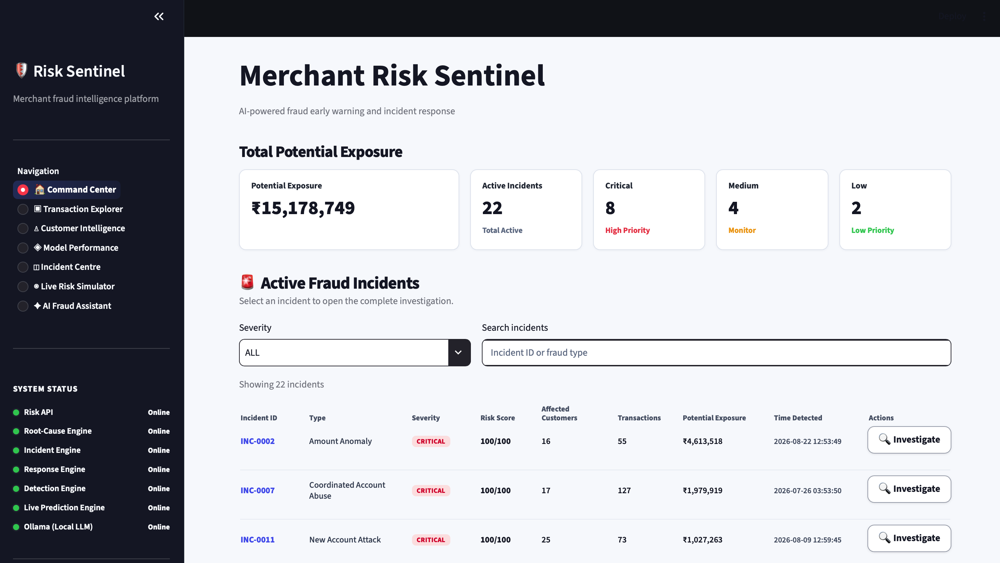
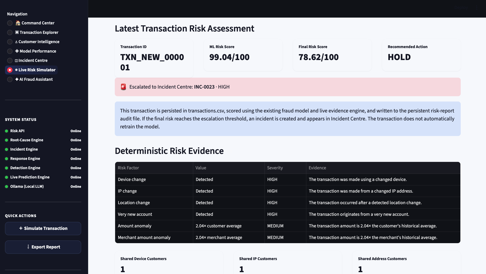
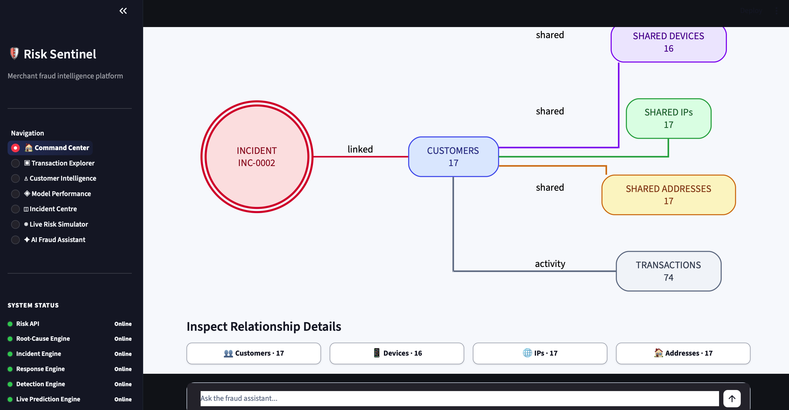

# Merchant Risk Sentinel

### AI Risk Manager — Fraud Detection & Investigation

Merchant Risk Sentinel is a defense-only fraud risk system built around a simple question:

**Can we identify suspicious transactions early enough to reduce financial loss, without creating so many false alarms that the system becomes difficult to operate?**

The project combines machine-learning based fraud scoring with behavioral signals, risk evidence, transaction relationship analysis, incident analysis, audit logging, and an API for live predictions.

The goal was not just to train a classifier and report an accuracy number. I wanted to build something closer to the workflow a risk team would actually need:

```text
Transaction
    ↓
Feature Engineering
    ↓
Fraud Probability
    ↓
Risk Score
    ↓
Risk Evidence
    ↓
Relationship Analysis
    ↓
Incident / Root Cause Analysis
    ↓
Recommended Response
    ↓
Audit Trail
```

---

## Why I Built This

Fraud detection is not simply a matter of predicting whether a transaction is fraudulent.

A model can have good accuracy and still be expensive to operate. If legitimate transactions are flagged too often, analysts spend their time investigating false alarms. If genuine fraud is missed, the business absorbs the financial loss.

That makes the trade-off between **false positives, false negatives, and financial exposure** important.

For this project, I treated the machine-learning model as one component of a larger risk system.

The system is designed to:

- Detect suspicious transactions
- Quantify fraud probability
- Identify behavioral risk signals
- Explain why a transaction was flagged
- Find relationships between transactions
- Analyze suspicious activity as incidents
- Recommend defensive actions
- Maintain an audit trail of live predictions

The project is strictly defense-only.

---

# AI Risk Manager Track

This project was built around the requirements of the **AI Risk Manager** track.

The track focuses on building a working detector, verifier, or auto-responder for a class of financial loss, backed by measured precision and recall and an honest treatment of false-positive cost.

Merchant Risk Sentinel approaches that problem through **fraud detection and investigation**.

The system does not stop at:

> "This transaction looks risky."

It tries to answer the questions that come next:

- How risky is it?
- What signals caused the risk?
- Is this transaction connected to other activity?
- What should an analyst investigate?
- What should happen to the transaction?
- What does it cost if the model is wrong?

---

# Key Features

## 1. Machine Learning Fraud Detection

A `HistGradientBoosting` model generates a fraud probability for each transaction.

The probability is converted into a risk score and operational risk level.

| Fraud Probability | Risk Level |
|---|---|
| `< 0.10` | LOW |
| `0.10 - 0.39` | MEDIUM |
| `0.40 - 0.74` | HIGH |
| `>= 0.75` | CRITICAL |

The current operating threshold is:

```text
0.30
```

The threshold was selected through validation rather than simply assuming that `0.50` is always the correct cutoff.

## 2. Behavioral Risk Signals

The feature pipeline includes signals related to customers, merchants, payment methods, accounts, devices, IP addresses, locations, refunds, chargebacks, and transaction timing.

Examples include:

- Customer transaction history
- Customer average transaction amount
- Merchant transaction history
- Merchant average transaction amount
- Payment method history
- Device reuse
- IP reuse
- Address reuse
- Account age
- Transaction velocity
- Location changes
- Device changes
- IP changes
- Refund behaviour
- Chargeback behaviour

## 3. Point-in-Time Feature Engineering

Historical customer and merchant features are calculated using information available **before the transaction being evaluated**.

This avoids using the transaction being predicted as part of its own historical statistics and helps reduce information leakage.

## 4. Temporal Model Evaluation

The evaluation pipeline uses a chronological split:

```text
60% → Training
20% → Validation
20% → Held-out Test
```

Transactions are sorted by timestamp before the split. This better represents a deployment scenario where a model is trained on historical data and then used on future transactions.

## 5. Threshold Optimization

The evaluation tests multiple probability thresholds rather than assuming `0.50` is the correct operating point.

It considers:

- Precision
- Recall
- F1
- True positives
- False positives
- True negatives
- False negatives
- False-positive investigation cost
- Missed fraudulent transaction exposure
- Expected loss

The current operating threshold is `0.30`.

## 6. Financial Cost Model

The project explicitly considers the cost of being wrong.

### False Positive

For the prototype evaluation, a legitimate transaction incorrectly flagged for investigation is assigned an estimated operational investigation cost of:

```text
₹500
```

This is a configurable prototype assumption, not a universal industry value.

### False Negative

A missed fraudulent transaction contributes its transaction amount to the estimated potential missed exposure.

For example, a missed fraudulent ₹50,000 transaction contributes ₹50,000 to the prototype exposure calculation.

This is intentionally a simple model. Production loss modelling would need to consider recovery rates, disputes, chargebacks, merchant policies, and other factors.

---

# Model Performance

The committed model metadata records:

```text
ROC-AUC: 0.971758
PR-AUC:  0.814966
Threshold: 0.30
```

ROC-AUC gives an overall view of ranking quality across thresholds.

PR-AUC is particularly useful for an imbalanced fraud classification problem.

The project does not rely on AUC alone. The evaluation pipeline also examines the confusion matrix and estimated financial cost at different operating thresholds.

The goal is to understand the trade-off between catching more fraud, creating more legitimate investigations, and reducing missed financial exposure.

---

# Risk Evidence

A fraud probability alone is not enough for an analyst.

Merchant Risk Sentinel has a separate risk-evidence layer that converts existing model and behavioral signals into structured evidence.

```text
ML Prediction
     ↓
Fraud Probability
     ↓
Behavioral Signals
     ↓
Risk Evidence
     ↓
Analyst Explanation
```

The evidence layer does not secretly change the model prediction. Its purpose is to make the available risk signals easier to understand during investigation.

---

# Fraud Relationship Analysis

Fraud is often not isolated to one transaction.

Multiple accounts may share a device, IP address, address, or other identifiers.

The relationship-analysis layer allows an analyst to investigate these connections.

```text
Customer A
     │
     ├── Device 123
     │
     └── Transaction 001
             │
             ├── Customer B
             │
             └── Transaction 019
```

This helps move an investigation from:

> "This transaction is suspicious."

towards:

> "This transaction is connected to other activity that may also need to be investigated."

The relationship endpoints are read-only.

---

# Dashboard

The project includes a dashboard for reviewing risk and investigating suspicious activity.

## Dashboard Overview

Add your screenshot here:

`docs/images/dashboard-overview.png`



## Live Risk Prediction

Add your screenshot here:

`docs/images/live-risk-prediction.png`



The prediction view should show the fraud probability, risk score, risk level, recommended action, and available evidence.

## Fraud Relationship Investigation

Add your screenshot here:

`docs/images/fraud-relationship-analysis.png`



This view demonstrates the investigation side of the project: examining connections between suspicious transactions through shared infrastructure such as devices, IP addresses, or addresses.

---

# Incident Analysis

Suspicious transactions can be analyzed as incidents rather than only as individual predictions.

The incident analysis layer works with signals such as:

- Risk level
- Incident type
- Behavioral indicators
- Transaction relationships
- Root-cause information

This gives the analyst more context around suspicious activity.

---

# Root Cause Analysis

The project includes a root-cause analysis component that converts risk signals into investigation reasons.

The goal is not to claim that the model understands intent. Instead, it provides structured explanations based on signals already present in the risk pipeline.

For example:

```text
New account
+
Very short transaction interval
+
New device
+
Location change
```

can be presented as a combination of signals worth investigating rather than relying only on a single probability.

---

# Response Engine

The response layer translates risk information into operational actions.

```text
LOW
    ↓
ALLOW

MEDIUM
    ↓
MONITOR

HIGH
    ↓
STEP_UP_VERIFICATION

CRITICAL
    ↓
HOLD_AND_INVESTIGATE
```

The response engine can also consider additional evidence such as transaction clusters and financial exposure.

This keeps prediction separate from operational response.

---

# Audit Trail

Live predictions are written to an audit trail.

An audit record can contain:

- Transaction information
- Fraud probability
- Risk score
- Risk level
- Recommended action
- Evidence
- Model version
- Operating threshold
- Incident information when available

This makes it possible to answer:

> "Why did the system make this decision?"

after the original prediction has already happened.

---

# API

The risk system is exposed through FastAPI.

## Health Check

```http
GET /health
```

Returns service health and whether the prediction model is loaded.

## Model Information

```http
GET /model-info
```

Returns model type, artifact information, operating threshold, and risk levels.

## Live Prediction

```http
POST /predict
```

Example request:

```json
{
  "customer_id": "CUS_000123",
  "merchant_id": "MER_000001",
  "amount": 12500,
  "timestamp": "2026-08-28T14:30:00",
  "payment_method": "UPI",
  "device_id": "DEV_000123",
  "ip_id": "IP_000123",
  "address_id": "ADDR_000123",
  "account_age_days": 8,
  "location": "Mumbai"
}
```

The response includes the transaction ID, fraud probability, risk score, risk level, recommended action, behavioral features, and structured evidence.

## Transaction Relationships

```http
GET /transactions/{transaction_id}/relationships
```

Returns relationship information around a transaction.

If the transaction does not exist, the API returns:

```text
404 Not Found
```

## Incident Relationships

```http
GET /incidents/{incident_id}/relationships
```

Returns relationship information associated with an incident.

---

# API Validation

The API validates incoming transaction data before it reaches the prediction pipeline.

Examples include:

- Required string fields
- Positive transaction amount
- Finite transaction amount
- Valid account age
- Required transaction identifiers

Invalid requests are rejected instead of being passed directly into the model.

---

# Testing

The project has an automated test suite covering the main components.

Current local test result:

```text
44 passed
```

The tests cover:

- Live model prediction
- API validation
- API endpoints
- Fraud graph relationships
- Incident severity
- Incident normalization
- Root-cause analysis
- Model threshold configuration
- Response engine
- Risk evidence
- Risk scoring

The repository also runs the tests through GitHub Actions.

The CI workflow rebuilds the required pipeline components before running the test suite:

```text
Checkout repository
        ↓
Install dependencies
        ↓
Generate transaction dataset
        ↓
Build fraud features
        ↓
Build model artifact
        ↓
Run pytest
```

---

# Project Structure

```text
merchant-risk-sentinel/
│
├── .github/
│   └── workflows/
│       └── tests.yml
│
├── data/
│   ├── raw/
│   └── processed/
│
├── reports/
│   ├── fraud_model_metadata.json
│   ├── strong_optimized_metrics.json
│   └── ...
│
├── scripts/
│   └── evaluate_model.py
│
├── src/
│   ├── analysis/
│   │   ├── fraud_graph.py
│   │   ├── incident_engine.py
│   │   ├── response_engine.py
│   │   ├── risk_evidence.py
│   │   └── root_cause_engine.py
│   │
│   ├── api/
│   │   └── app.py
│   │
│   ├── audit/
│   │   └── audit_logger.py
│   │
│   ├── chatbot/
│   │   └── fraud_assistant.py
│   │
│   ├── features/
│   │   └── build_features.py
│   │
│   ├── models/
│   │   ├── build_model_artifact.py
│   │   ├── live_predictor.py
│   │   ├── train_model.py
│   │   ├── train_strong_model.py
│   │   └── ...
│   │
│   ├── dashboard.py
│   └── generate_data.py
│
├── tests/
│   ├── test_api.py
│   ├── test_fraud_graph.py
│   ├── test_incident_engine.py
│   ├── test_model_configuration.py
│   ├── test_response_engine.py
│   ├── test_risk_evidence.py
│   └── test_risk_score.py
│
├── requirements.txt
└── README.md
```

---

# Running Locally

Create a virtual environment:

```bash
python -m venv .venv
```

Activate it:

```bash
source .venv/bin/activate
```

On Windows:

```powershell
.venv\Scriptsctivate
```

Install dependencies:

```bash
pip install -r requirements.txt
```

Generate the transaction dataset:

```bash
python src/generate_data.py
```

Build the feature dataset:

```bash
python src/features/build_features.py
```

Build the model artifact:

```bash
python src/models/build_model_artifact.py
```

Run the tests:

```bash
pytest -v
```

Expected result:

```text
44 passed
```

---

# Running the API

```bash
uvicorn src.api.app:app --reload
```

FastAPI also provides interactive API documentation through Swagger UI.

---

# Running the Dashboard

```bash
streamlit run src/dashboard.py
```

---

# Engineering Decisions

## Avoiding Data Leakage

Historical features use information available before the transaction being scored.

## Temporal Evaluation

The dataset is split chronologically so later transactions behave more like future production data.

## Cost-Aware Thresholding

The operating threshold is selected using a business-cost model rather than blindly using `0.50`.

## Separation of Concerns

The model predicts risk.

The evidence layer explains signals.

The response engine determines an operational recommendation.

The relationship engine investigates connected activity.

The audit layer records the decision.

Keeping these responsibilities separate makes each part easier to test and reason about.

## Read-Only Investigation

Relationship analysis is an investigation capability and does not modify the underlying transaction records.

---

# Limitations

This is a working prototype, not a production payment-risk platform.

The transaction dataset used during development is generated data. It is useful for developing and testing the pipeline, but it does not capture the full complexity of real payment traffic.

The financial cost model is also deliberately simple.

In production, the cost of a false positive could include analyst time, customer friction, conversion loss, merchant impact, and verification cost.

Likewise, the financial impact of a missed fraud transaction is not necessarily equal to the transaction amount.

A production implementation would require additional work around:

- Model drift
- Probability calibration
- Feature freshness
- Real-time feature stores
- Data quality
- Monitoring
- Retraining
- Privacy
- Access control
- Analyst feedback
- Merchant-specific policies
- Production authentication and authorization

---

# Future Work

If I continued developing the project, the next areas I would focus on are:

1. Real-time streaming features for transaction velocity
2. Better probability calibration
3. Merchant-specific risk thresholds
4. Graph-based fraud cluster scoring
5. Model drift monitoring
6. Analyst feedback loops
7. More realistic financial loss modelling
8. Production feature-store integration
9. Stronger API authentication and authorization
10. Monitoring model performance over time

---

# Defense-Only Scope

Merchant Risk Sentinel is strictly focused on defensive fraud detection and investigation.

The system is designed to:

- Detect suspicious transactions
- Surface risk signals
- Investigate connected activity
- Recommend defensive actions
- Support analysts
- Record prediction decisions

It does not provide functionality for:

- Carrying out fraud
- Bypassing payment controls
- Stealing credentials
- Evading fraud detection
- Exploiting payment systems

---

# Tech Stack

### Programming
- Python

### Machine Learning
- scikit-learn
- HistGradientBoosting
- pandas
- NumPy

### API
- FastAPI
- Pydantic

### Dashboard
- Streamlit

### Testing
- pytest

### Data and Model Artifacts
- CSV
- JSON
- joblib

### CI
- GitHub Actions

---

# What This Project Demonstrates

The main thing I wanted to demonstrate with this project was not simply that I could train a machine-learning model.

I wanted to build the pieces around the model that make it useful in a risk workflow:

```text
Detection
   ↓
Evaluation
   ↓
Evidence
   ↓
Investigation
   ↓
Response
   ↓
Auditability
```

The project therefore combines machine learning with backend engineering, feature engineering, API development, testing, CI, and investigation tooling.

It is still a prototype, and there are clear gaps before something like this could be used in a real payment environment.

But the architecture is built around the questions that matter when moving from a model in a notebook to an actual risk system:

**Can it detect the problem?**

**Can we measure how well it works?**

**Do we understand the cost of being wrong?**

**Can an analyst investigate the result?**

**Can we explain what happened afterwards?**

That is the problem Merchant Risk Sentinel is intended to solve.
